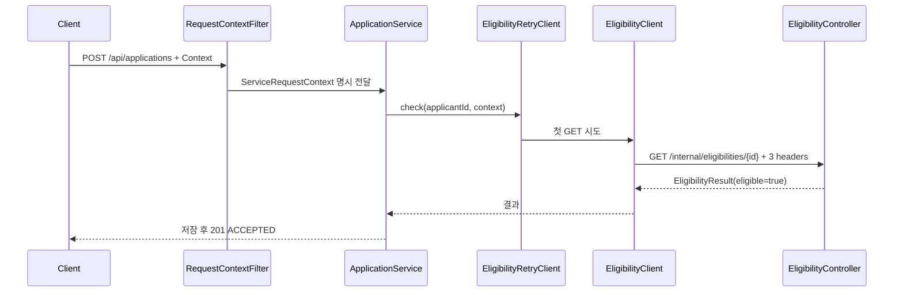
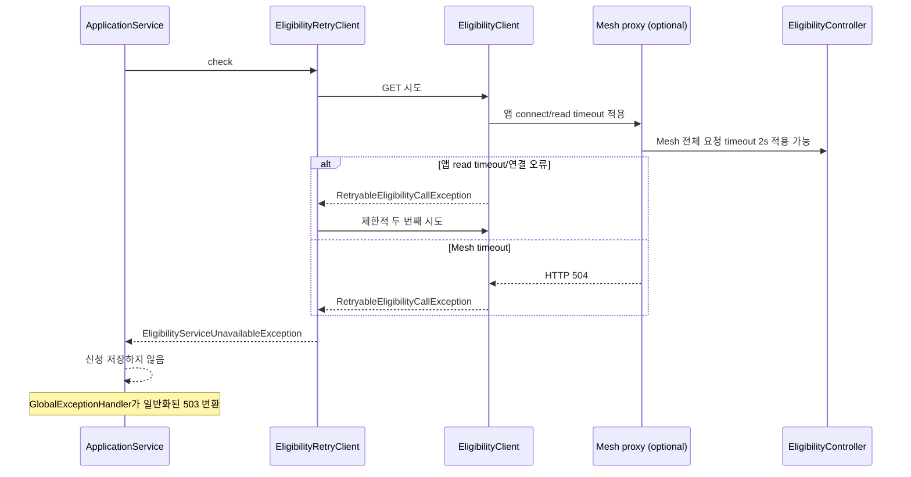

# 4.1.8 가이드–구현 매핑

| 가이드 내용 | 구현 위치 |
|---|---|
| 공통 REST 호출 및 Context 전달 | `EligibilityClient`, `RequestContextFilter` |
| 연결·응답 타임아웃 | `RestClientConfiguration`, `EligibilityClientProperties` |
| 제한적 재시도/복구 | `EligibilityRetryClient` |
| 부적격 처리와 저장 | `ApplicationService` |
| 공통 오류 변환 | `GlobalExceptionHandler` |
| Mesh 전체 요청 타임아웃 | `deploy/istio/eligibility-timeout-virtual-service.yaml` |
| 교육용 지연/오류 | `DemoOnlyEligibilityBehaviorController`, `DemoOnlyBehaviorStore` |
| Context 수신 검증 | `ReceivedContextStore` |

## 정상 호출

## 애플리케이션 또는 Mesh 타임아웃

