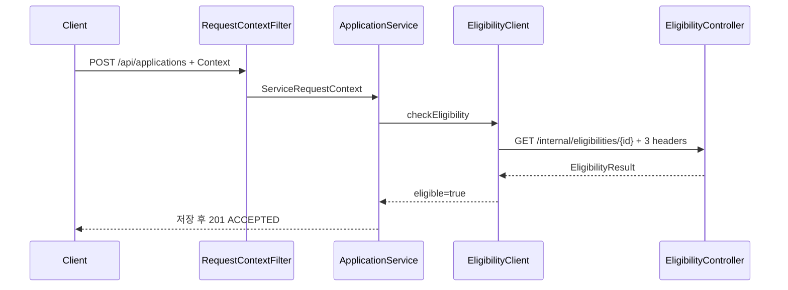
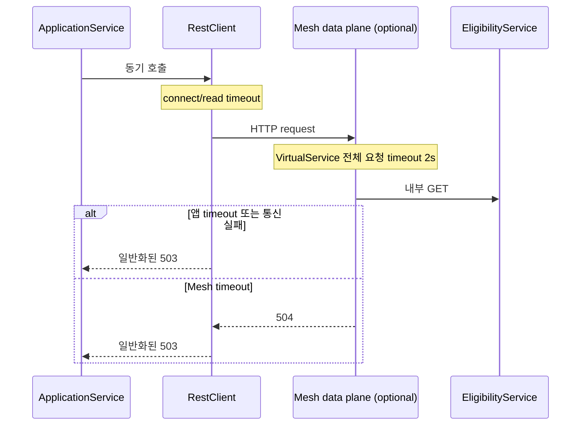

# 4.1.8 가이드–구현 매핑

| 가이드 내용 | 구현 위치 | 검증 |
|---|---|---|
| 동기 REST 호출 | `EligibilityClient`, `EligibilityController` | 정상 신청 테스트 |
| Context 전달 | `RequestContextFilter`, `ServiceRequestContext`, `EligibilityClient` | 세 헤더 전달·ID 생성·요청 격리 테스트 |
| connectTimeout/readTimeout | `EligibilityClientProperties`, `RestClientConfiguration` | 프로필 로딩과 read timeout 테스트 |
| 애플리케이션 timeout 오류 처리 | `EligibilityClient`, `GlobalExceptionHandler` | 일반화된 503 및 내부 정보 미노출 테스트 |
| VirtualService timeout | `deploy/istio/eligibility-timeout-virtual-service.yaml` | `timeout: 2s` 정적 검증 |
| 정상·지연·오류 검증 | `DemoOnlyBehaviorStore`, Postman | ELIGIBLE, INELIGIBLE, DELAY, ERROR |

## 정상 호출

## 타임아웃 적용 위치

Mesh 정책은 timeout 응답을 생성하고, 이를 외부 업무 오류로 변환하며 내부 정보를 숨기는 책임은 application-service에 있다.
